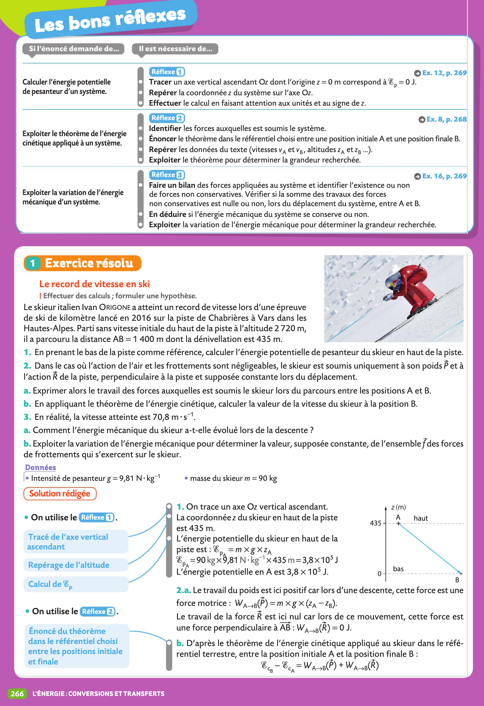

# Documents

!!! success "Consignes"
    - Cours: Veillez à toujours avoir imprimé le chapitre suivant à l'avance ainsi lorsque l'on passera à un nouveau chapitre vous l'aurez prêt.
    - TP: Terminez systématiquement de rédiger le dernier TP qui a eu lieu et préparez le suivant pour la prochaine séance de TP. 

{# écrire `cache/` ou `data/` pour cacher ou non un fichier #} 

??? abstract "Chapitre 1: Composition d'un système chimique"
    - [📚Chapitre I](data/Chapitre I cours élèves 1eSPE.pdf){:target="_blank"}
    - [⚛️TP1 Préparation d'une solution colorée](data/TP01 Préparation solution colorée élève.pdf){:target="_blank"}
    - [⚛️TP1 Protocole de dilution à distribuer après proposition (édit)](cache/TP01 Protocole dilution à distribuer.pdf){:target="_blank"}
    - [⚛️TP2 Dosage spectrophotométrique du dakin - Loi de Beer Lambert](data/TP02 Dosage spectro dakin élève.pdf){:target="_blank"}    
    ??? abstract "Exercices du livre (pages 24 à 30)"
        
        
        
        
        
        
        

    
??? abstract "Chapitre 2: De la structure à la polarité d'une entité"
    - [📚Chapitre II](data/Chapitre II cours élèves.pdf){:target="_blank"}
    - [⚛️TP3  Géométrie des molécules et polarité (préparation)](data/TP03 Géométrie des molécules et polarité (préparation).pdf){:target="_blank"}
    - [⚛️TP3 Géométrie des molécules et polarité](data/TP03 Géométrie des molécules et polarité.pdf){:target="_blank"}
    - [Fiche méthode Prise en main de jmol](data/prise en main de jmol.pdf){:target="_blank"}
    - [Télécharger Jmol](http://sourceforge.net/projects/jmol/files/latest/download?source=files){:target="_blank"}
    ??? abstract "Exercices du livre (pages 89 à 96)"
        
        
        
        
        
        
        
                
    
??? abstract "Chapitre 3: Cohésion et dissolution des solides"
    - [📚Chapitre III](data/Chapitre III cours élèves.pdf){:target="_blank"}
    - [⚛️TP4 Solubilité](data/TP04 Solubilite élève.pdf){:target="_blank"}
    - [⚛️TP5 Les propriétés des savons (préparation)](data/TP05 Les propriétés des savons (préparation).pdf){:target="_blank"}
    - [⚛️TP5 Les propriétés des savons](data/TP05 Les propriétés des savons élève.pdf){:target="_blank"}
    ??? abstract "Exercices du livre (pages 112 à 116)" 
        
        
        
        
        

    
??? abstract "Chapitre 4: Image et lentille"
    - [📚Chapitre IV](data/Chapitre IV cours élèves.pdf){:target="_blank"}
    - [Fiche méthode Atelier Scientifique pour la relation de conjugaison](data/Fiche méthode Atelier Scientifique pour la relation de conjugaison.pdf){:target="_blank"}
    - [⚛️TP6 Relation de conjugaison](data/TP06 Hyperm-rel-de-conjug-élève.pdf){:target="_blank"}
    - [⚛️TP7 Mise au point](data/TP07 Mise au point élève.pdf){:target="_blank"}

??? abstract "Chapitre 5: Couleur d'un objet"
    - [📚Chapitre V](Chapitre V cours Couleur d'un objet élève.pdf){:target="_blank"}
    - [⚛️TP8 Synthèse couleur](data/TP08 Synthèse couleur élève.pdf){:target="_blank"}

 
??? abstract "Chapitre 6: La lumière"
    - [📚Chapitre VI](data/Chapitre VI cours Photon élève.pdf){:target="_blank"}
    - [⚛️TP9 La lampe à vapeur de mercure](data/TP09 Lampe Hg photon énergie élève.pdf){:target="_blank"}
 
??? abstract "Chapitre 7: Structure des composés organiques"
    - [📚Chapitre VII](data/Chapitre VII cours élève.pdf){:target="_blank"}
    - [⚛️TP10 Identification de molécules](data/TP10 Spectres IR élève.pdf){:target="_blank"}
 
 
??? abstract "Chapitre 8: Synthèse de composés organiques"
    - [📚Chapitre VIII](data/Chapitre VIII cours élèves.pdf){:target="_blank"}
    - [⚛️TP11 Synthèse du paracetamol](data/TP11 Synthèse du paracetamol élève.pdf      ){:target="_blank"}
    - [⚛️TP12 Identification du paracetamol](data/TP12 Identification du paracetamol élève.pdf){:target="_blank"}
    
??? abstract "Chapitre 9: Interactions gravitationnelles et électriques"
    - [📚Chapitre IX](data/Chapitre IX cours champs élève.pdf){:target="_blank"}
    - [Activité documentaire sur la notion de champs](data/AD Chapitre IX intro Champs.pdf){:target="_blank"}
    - [⚛️TP13 Champ électrique](data/TP13 Champ électrique élève.pdf){:target="_blank"}    
 
??? abstract "Chapitre 10: Mouvement"
    - [📚Chapitre X](data/Chapitre X cours mouvements élèves.pdf){:target="_blank"}
    - [⚛️TP14 Mouvements](data/TP14 Mouvement élèves.pdf){:target="_blank"}    
    
??? abstract "Chapitre 11: Énergie mécanique"
    - [📚Chapitre XI](data/Chapitre XI cours EmEcEpp élèves.pdf){:target="_blank"}
    - [⚛️TP15 Évolution de l'énergie mécanique](data/TP15 Évolution énergie mécanique élèves.pdf){:target="_blank"}    
    - [⚛️TP16 Le théorème de l'énergie cinétique](data/TP16 Énergie cinétique élèves.pdf){:target="_blank"}        
    ??? abstract "Exercices du livre (pages 266 à 275)"
        
        
        
        
        

 
??? abstract "Chapitre 12: Oxydoréduction et avancement"
    - [📚Chapitre XII](data/Chapitre XII redox élèves.pdf){:target="_blank"}
    - [⚛️TP17 Les réactions d'oxydoréduction](data/TP17 Redox  élèves.pdf){:target="_blank"}    
    - [⚛️TP17 bis D’autres réactions d'oxydoréduction](data/TP17bis Réactions redox élèves.pdf){:target="_blank"}    
    - [⚛️TP18 Avancement](data/TP18 Avancement élèves.pdf){:target="_blank"}        

 
??? abstract "Chapitre 13: Avancement et titrage"
    - [📚Chapitre XIII](data/Chapitre XIII cours élèves.pdf){:target="_blank"}
    - [⚛️TP19 Retrouver le titre d'une solution](data/TP19 Titrage élèves.pdf){:target="_blank"}    
    - [⚛️TP20 Titrage Lugol diiode](data/TP20 Titrage diiode Lugol élève.pdf){:target="_blank"}    

 
??? abstract "Chapitre 14: Énergie électrique"
    - [📚Chapitre XIV](data/Chapitre XIV cours énergie électrique élèves.pdf){:target="_blank"}
    - [⚛️TP21 Modélisation d'un panneau photovoltaïque](data/TP21 Photovoltaique partie1 élèves.pdf){:target="_blank"}    
    - [⚛️TP21 bis Rendement d'un panneau photovoltaïque](data/TP21 bis Photovoltaique partie2 rendement élèves.pdf){:target="_blank"}    

 
??? abstract "Chapitre 15: Les ondes"
    - [📚Chapitre XV](data/Chapitre XV cours ondes élèves.pdf){:target="_blank"}
    - [⚛️TP22 Les ultrasons](data/TP22 Ondes mécaniques ultrasons élèves.pdf){:target="_blank"}    

??? abstract "Chapitre 16: Pression"
    - [📚Chapitre XVI](data/Chapitre XVI cours élève.pdf){:target="_blank"}
    - [⚛️TP23 Statique des fluides](data/TP23 Statique des fluides élèves.pdf){:target="_blank"}    
    - [⚛️TP24 Loi de Mariotte (préparation)](data/TP24 Loi de Mariotte préparation élèves.pdf){:target="_blank"}    
    - [⚛️TP24 Loi de Mariotte](data/TP24 Loi de Mariotte élèves.pdf){:target="_blank"}        

??? abstract "Chapitre 17: Combustion"
    - [📚Chapitre XVII](data/Chapitre XVII cours Combustions élèves.pdf){:target="_blank"}
    - [Activité documentaire sur les combustions](data/AD Chapitre XVII Combustion1.pdf){:target="_blank"}    
    - [De l'énergie pour la cuisson](data/AD Chapitre XVII Combustion2.pdf){:target="_blank"}    
    ??? abstract "Exercices du livre (pages 164 à 166)"
        
        
        

