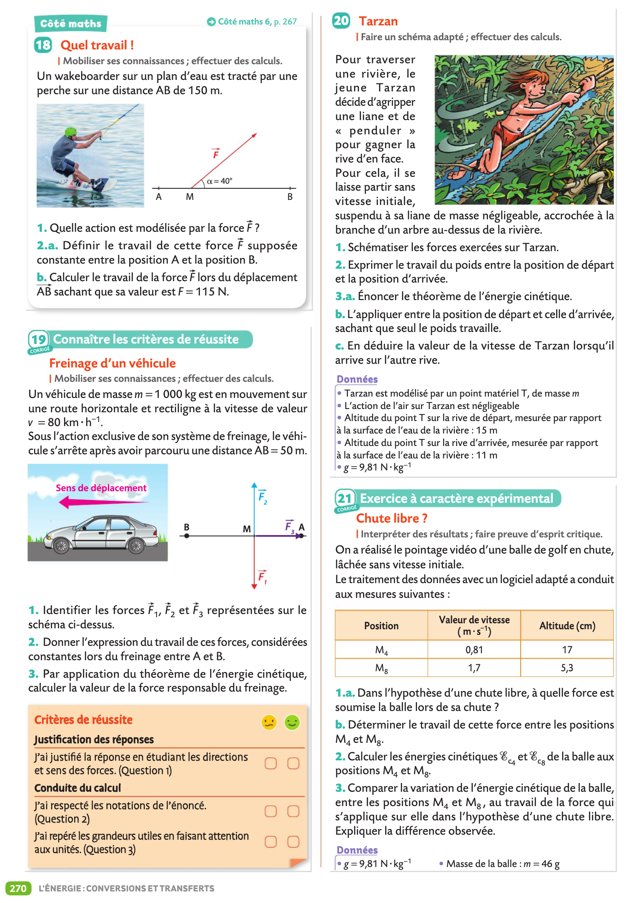
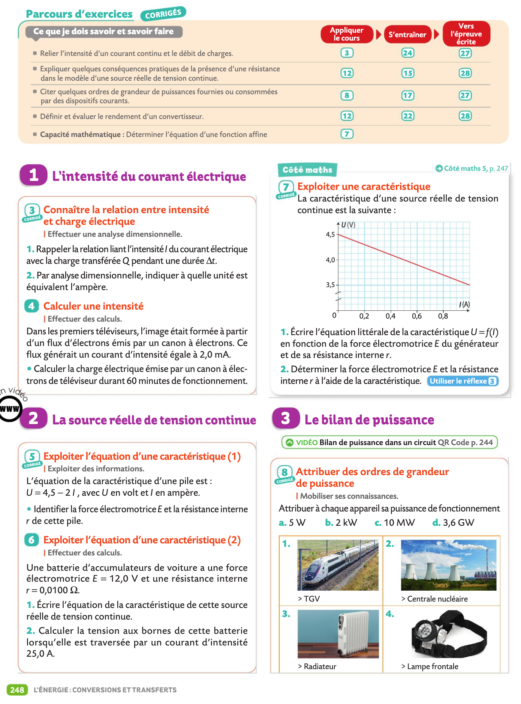

# Cours et TP

!!! success "Consignes"
    - Cours: Veillez à toujours avoir imprimé le chapitre suivant à l'avance ainsi lorsque l'on passera à un nouveau chapitre vous l'aurez à votre disposition.
    - Travaux Pratiques: Terminez systématiquement de rédiger le dernier TP qui a eu lieu et préparez le suivant pour la prochaine séance de TP. 

{# écrire `cache/` ou `data/` pour cacher ou non un fichier #} 

??? abstract "Chapitre 1: Composition d'un système chimique"
    - [📚Chapitre I](data/Chapitre I cours eleves.pdf){:target="_blank"}
    - [⚛️TP1 Préparation d'une solution colorée](data/TP01 Preparation solution coloree eleve.pdf){:target="_blank"}
    - [⚛️TP1 Protocole de dilution à distribuer après proposition (édit)](cache/TP01 Protocole dilution a distribuer.pdf){:target="_blank"}
    - [⚛️TP2 Dosage spectrophotométrique du dakin - Loi de Beer Lambert](data/TP02 Dosage spectro dakin eleve.pdf){:target="_blank"}    
    ??? question "Exercices du livre (pages 24 à 30)"
        
        
        
        
        
        
        

    
??? abstract "Chapitre 2: De la structure à la polarité d'une entité"
    - [📚Chapitre II](data/Chapitre II cours eleves.pdf){:target="_blank"}
    - [⚛️TP3  Géométrie des molécules et polarité (préparation)](data/TP03 Geometrie des molecules et polarite (preparation).pdf){:target="_blank"}
    - [⚛️TP3 Géométrie des molécules et polarité](data/TP03 Geometrie des molecules et polarite.pdf){:target="_blank"}
    - [Fiche méthode Prise en main de jmol](data/prise en main de jmol.pdf){:target="_blank"}
    - [Télécharger Jmol](http://sourceforge.net/projects/jmol/files/latest/download?source=files){:target="_blank"}
    ??? question "Exercices du livre (pages 89 à 96)"
        
        
        
        
        
        
        
                
    
??? abstract "Chapitre 3: Cohésion et dissolution des solides"
    - [📚Chapitre III](data/Chapitre III cours eleves.pdf){:target="_blank"}
    - [⚛️TP4 Solubilité](data/TP04 Solubilite eleve.pdf){:target="_blank"}
    - [⚛️TP5 Les propriétés des savons (préparation)](data/TP05 Les proprietes des savons (preparation).pdf){:target="_blank"}
    - [⚛️TP5 Les propriétés des savons](data/TP05 Les proprietes des savons eleve.pdf){:target="_blank"}
    ??? question "Exercices du livre (pages 112 à 116)" 
        
        
        
        
        

    
??? abstract "Chapitre 4: Image et lentille"
    - [📚Chapitre IV](data/Chapitre IV cours eleves.pdf){:target="_blank"}
    - [Fiche méthode Atelier Scientifique pour la relation de conjugaison](data/Fiche methode Atelier Scientifique pour la relation de conjugaison.pdf){:target="_blank"}
    - [⚛️TP6 Relation de conjugaison](data/TP06 Hyperm-rel-de-conjug-eleve.pdf){:target="_blank"}
    - [⚛️TP7 Mise au point](data/TP07 Mise au point eleve.pdf){:target="_blank"}
    ??? question "Exercices du livre (pages 314 à 319)" 
        
        
        
        
        

??? abstract "Chapitre 5: Couleur d'un objet"
    - [📚Chapitre V](data/Chapitre V cours eleve.pdf){:target="_blank"}
    - [⚛️TP8 Synthèse couleur](data/TP08 Synthese couleur eleve.pdf){:target="_blank"}
    ??? question "Exercices du livre (pages 330 à 334)" 
        
        
        
        
        

 
??? abstract "Chapitre 6: La lumière"
    - [📚Chapitre VI](data/Chapitre VI cours Photon eleve.pdf){:target="_blank"}
    - [⚛️TP9 La lampe à vapeur de mercure](data/TP09 Lampe Hg photon energie eleve.pdf){:target="_blank"}
    ??? question "Exercices du livre (pages 346 à 352)" 
        
        
         
        
        
        
        
         
         
         
??? abstract "Chapitre 7: Structure des composés organiques"
    - [📚Chapitre VII](data/Chapitre VII cours eleve.pdf){:target="_blank"}
    - [⚛️TP10 Identification de molécules](data/TP10 Spectres IR eleve.pdf){:target="_blank"}
    ??? question "Exercices du livre (pages 130 à 134)" 
        
        
        
        
        
 
 
??? abstract "Chapitre 8: Synthèse de composés organiques"
    - [📚Chapitre VIII](data/Chapitre VIII cours eleves.pdf){:target="_blank"}
    - [⚛️TP11 Synthèse du paracetamol](data/TP11 Synthese du paracetamol eleve.pdf      ){:target="_blank"}
    - [⚛️TP12 Identification du paracetamol](data/TP12 Identification du paracetamol eleve.pdf){:target="_blank"}
    ??? question "Exercices du livre (pages 148 à 152)" 
         
        
        
        
        
    
??? abstract "Chapitre 9: Interactions gravitationnelles et électriques"
    - [📚Chapitre IX](data/Chapitre IX cours champs eleve.pdf){:target="_blank"}
    - [Activité documentaire sur la notion de champs](data/AD Chapitre IX intro Champs.pdf){:target="_blank"}
    - [⚛️TP13 Champ électrique](data/TP13 Champ electrique eleve.pdf){:target="_blank"}    
    ??? question "Exercices du livre (pages 184 à 190)"
        
        
        
        
        
        
        

??? abstract "Chapitre 10: Mouvement"
    - [📚Chapitre X](data/Chapitre X cours mouvements eleves.pdf){:target="_blank"}
    - [⚛️TP14 Mouvements](data/TP14 Mouvement eleves.pdf){:target="_blank"}    
    ??? question "Exercices du livre (pages 224 à 230)"
        
        
        
        
        
        
        
    
??? abstract "Chapitre 11: Énergie mécanique"
    - [📚Chapitre XI](data/Chapitre XI cours EmEcEpp eleves.pdf){:target="_blank"}
    - [⚛️TP15 Évolution de l'énergie mécanique](data/TP15 Evolution energie mecanique eleves.pdf){:target="_blank"}    
    - [⚛️TP16 Le théorème de l'énergie cinétique](data/TP16 Energie cinetique eleves.pdf){:target="_blank"}        
    ??? question "Exercices du livre (pages 266 à 274)"
        
                
        
                
        
                
        
                
        

 
??? abstract "Chapitre 12: Oxydoréduction et avancement"
    - [📚Chapitre XII](data/Chapitre XII redox eleves.pdf){:target="_blank"}
    - [⚛️TP17 Les réactions d'oxydoréduction](data/TP17 Redox  eleves.pdf){:target="_blank"}    
    - [⚛️TP17 bis D’autres réactions d'oxydoréduction](data/TP17bis Reactions redox eleves.pdf){:target="_blank"}    
    - [⚛️TP18 Avancement](data/TP18 Avancement eleves.pdf){:target="_blank"}        
    - [🐍 Bilan de matière](python.md)
    ??? question "Exercices du livre (pages 42 à 47) & (pages 56 à 62)"
        
        
        
        
        
        
        
        
        
        
        
        
        
 
 
 
??? abstract "Chapitre 13: Avancement et titrage"
    - [📚Chapitre XIII](data/Chapitre XIII cours eleves.pdf){:target="_blank"}
    - [⚛️TP19 Retrouver le titre d'une solution](data/TP19 Titrage eleves.pdf){:target="_blank"}    
    - [⚛️TP20 Titrage Lugol diiode](data/TP20 Titrage diiode Lugol eleve.pdf){:target="_blank"}    
    - [🐍 Titrage](python.md)
    ??? question "Exercices du livre (pages 73 à 76)"
        
        
        
        
        
        
 
 
??? abstract "Chapitre 14: Énergie électrique"
    - [📚Chapitre XIV](data/Chapitre XIV cours energie electrique eleves.pdf){:target="_blank"}
    - [⚛️TP21 Modélisation d'un panneau photovoltaïque](data/TP21 Photovoltaique partie1 eleves.pdf){:target="_blank"}    
    - [⚛️TP21 bis Rendement d'un panneau photovoltaïque](data/TP21bis Photovoltaique partie2 rendement eleves.pdf){:target="_blank"}    
    - [🐍 Bilan de puissance et rendement](python.md)    
    ??? question "Exercices du livre (pages 246 à 252)"
        
        
        
        
        
        
        

 
??? abstract "Chapitre 15: Les ondes"
    - [📚Chapitre XV (diaporama)](data/Chapitre XV cours ondes eleves.pdf){:target="_blank"}
    - [⚛️TP22 Les ultrasons](data/TP22 Ondes mecaniques ultrasons eleves.pdf){:target="_blank"}    
    ??? question "Exercices du livre (pages 294 à 300)"
        
        
        
        
        
        
        

??? abstract "Chapitre 16: Pression"
    - [📚Chapitre XVI](data/Chapitre XVI cours eleve.pdf){:target="_blank"}
    - [⚛️TP23 Statique des fluides](data/TP23 Statique des fluides eleves.pdf){:target="_blank"}    
    - [⚛️TP24 Loi de Mariotte (préparation)](data/TP24 Loi de Mariotte preparation eleves.pdf){:target="_blank"}    
    - [⚛️TP24 Loi de Mariotte](data/TP24 Loi de Mariotte eleves.pdf){:target="_blank"}        
    ??? question "Exercices du livre (pages 204 à 210)"
        
        
        
        
        
        
        

??? abstract "Chapitre 17: Combustion"
    - [📚Chapitre XVII](data/Chapitre XVII cours Combustions eleves.pdf){:target="_blank"}
    - [Activité d'introduction sur les combustions](data/AD Chapitre XVII Combustion1.pdf){:target="_blank"}    
    - [Combustion et oxydoréduction](data/AD Chapitre XVII Combustion2.pdf){:target="_blank"}    
    ??? question "Exercices du livre (pages 164 à 166)"
        
        
        

