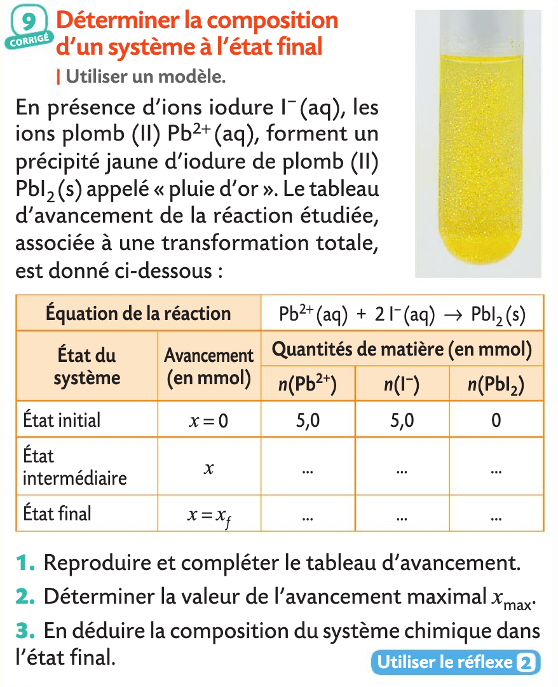

# Python en Physique-Chimie
{{ initexo(0) }}


!!! example "{{ exercice() }} : Bilan de matière (ex 23 page 63)"
    === "Énoncé"
        1. Compléter le code suivant:
        ``` python  linenums="1"
        ## Bilan de matière
        print("Équation de la réaction : aA + bB -> cC + dD")
        print("Entrez les valeurs des nombres stochiométriques:")
        a = float(input("a = "))
        b = ... # à vous
        c = ... # à vous
        d = ... # à vous
        print("Entrez les quantités initiales de réactifs A et B en mol")
        nA = float(input("n0(A) = "))
        nB = float(input("n0(B) = "))
        # Détermination de xmax et du réactif limitant
        xmaxA, xmaxB = nA / a, nB / b
        if xmaxA == xmaxB:
            print("Le mélange est stoichiométrique")
            xmax = xmaxA
        elif xmaxA < xmaxB:
            print("...  est le réactif limitant") # à vous
            xmax = xmaxA
        else:
            print("...  est le réactif limitant") # à vous
            xmax = xmaxB
        print(f"xmax = {xmax} mol")
        # Détemination des quantités de matière à l'état final        
        nfA, nfB = nA - a * xmax, nB - b * xmax
        nfC, nfD = c * xmax, d * xmax
        print("Quantités de matière à l'état final")
        print(f"nf(A) = {nfA} mol")
        print(f"nf(B) = {nfB} mol")
        print(f"nf(C) = {nfC} mol")
        print(f"nf(D) = {nfD} mol")
        ```        
        
        **Code Capytale:** 2787-6384519
        
        2. Utiliser le programme précédent pour résoudre l'exercice suivant:
        { width="50%" }


    === "Correction"
        1. Code source:
        ``` python  linenums="1"
        ## Bilan de matière
        print("Équation de la réaction : aA + bB -> cC + dD")
        print("Entrez les valeurs des nombres stochiométriques:")
        a = float(input("a = "))
        b = float(input("b = "))
        c = float(input("c = "))
        d = float(input("d = "))
        print("Entrez les quantités initiales de réactifs A et B en mol")
        nA = float(input("n0(A) = "))
        nB = float(input("n0(B) = "))
        # Détermination de xmax et du réactif limitant
        xmaxA, xmaxB = nA / a, nB / b
        if xmaxA == xmaxB:
            print("Le mélange est stoichiométrique")
            xmax = xmaxA
        elif xmaxA < xmaxB:
            print("A est le réactif limitant")
            xmax = xmaxA
        else:
            print("B est le réactif limitant")
            xmax = xmaxB
        print(f"xmax = {xmax} mol")
        # Détemination des quantités de matière à l'état final
        nfA, nfB = nA - a * xmax, nB - b * xmax
        nfC, nfD = c * xmax, d * xmax
        print("Quantités de matière à l'état final")
        print(f"nf(A) = {nfA} mol")
        print(f"nf(B) = {nfB} mol")
        print(f"nf(C) = {nfC} mol")
        print(f"nf(D) = {nfD} mol")
        ```        
        **Remarque :** On peut comparer le code précédent à celui donné à l'exercice 23 page 63 qui semble un peu plus compliqué car il utilise `"\n"` pour des retours à la ligne et `.format()` plutôt que d'utiliser des `fstring`.
        2. Exécuter le programme et saisir  `a = 1`, `b = 2`, `c = 1` et `d = 0` puis `n0(A) = 5` et `n0(B) = 5`.
        ```pycon
        Équation de la réaction : aA + bB -> cC + dD
        Entrez les valeurs des nombres stochiométriques:
        a = 1
        b = 2
        c = 1
        d = 0
        Entrez les quantités initiales de réactifs A et B en
         mol
        n0(A) = 5
        n0(B) = 5
        B est le réactif limitant
        xmax = 2.5 mol
        Quantités de matière à l'état final
        nf(A) = 2.5 mol
        nf(B) = 0.0 mol
        nf(C) = 2.5 mol
        nf(D) = 0.0 mol
        ```


    
