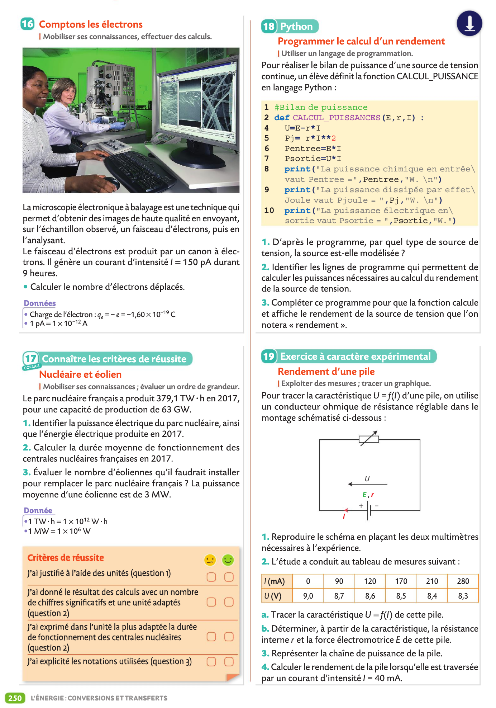

# Python en Physique-Chimie
{{ initexo(0) }}


!!! example "{{ exercice() }} : Bilan de matière"
    === "Énoncé"
        1. Compléter le code suivant dans Capytale (**Code :** 2787-6384519)
           ```python  linenums="1"
           ## Bilan de matière
           print("Équation de la réaction : aA + bB -> cC + dD")
           print("Entrez les valeurs des nombres stochiométriques:")
           a = float(input("a = ")) # (1)
           b = ... # à vous
           c = ... # à vous
           d = ... # à vous
           print("Entrez les quantités initiales de réactifs A et B en mol")
           nA = float(input("n0(A) = "))
           nB = float(input("n0(B) = "))
           # Détermination de xmax et du réactif limitant
           xmaxA, xmaxB = nA / a, nB / b # (2)
           if xmaxA == xmaxB: # (3)
               print("Le mélange est stoichiométrique")
               xmax = xmaxA
           elif xmaxA < xmaxB:
               print("...  est le réactif limitant") # à vous
               xmax = xmaxA # (4) 
           else:
               print("...  est le réactif limitant") # à vous
               xmax = xmaxB # (5)
           print(f"xmax = {xmax} mol")
           # Détemination des quantités de matière à l'état final        
           nfA, nfB = nA - a * xmax, nB - b * xmax # (6) 
           nfC, nfD = c * xmax, d * xmax # (7)
           print("Quantités de matière à l'état final")
           print(f"nf(A) = {nfA} mol")
           print(f"nf(B) = {nfB} mol")
           print(f"nf(C) = {nfC} mol")
           print(f"nf(D) = {nfD} mol")
           ```
            1. La fonction `input()` renvoie le texte (on parle de chaîne de caractère) saisie par l'utilisateur (par exemple la chaîne `"1"`) . Ensuite la chaîne peut être convertie en entier avec la fonction `int()` (soit pour l'exemple, l'entier `1`) ou en réel avec la fonction `float()` comme c'est le cas ici (soit pour l'exemple, le flottant `1.0`).
            2. Réalisation d'une double affectation en une seule ligne. À la place, on aurait pu écrire `xmaxA = nA / a` sur une ligne et sur la ligne suivante on aurait écrit `xmaxB = nB / b`.
            3. En python le symbole d'égalité n'est pas `=` mais `==` car en python le signe égal est utilisé pour les affectations. Une affectation ressemble parfois à une égalité ; par exemple si l'on écrit `x = 5`. Mais, ce n'en est pas une, comme on le voit quand on écrit `x = x+1` qui n'a pas le sens mathématique d'égalité, mais le sens informatique d'affectation conduisant ici à `x = 6`. 
            4. Ceci n'est pas une égalité, c'est une affectation.
            5. Ceci n'est pas une égalité, c'est une affectation.
            6. Double affectation pour les réactifs restants.
            7. Double affectation pour les produits formés.

        2. Utiliser le programme précédent pour résoudre l'exercice suivant:
           { width="50%" }

    === "Correction"
        1. Code source (ex 23 page 63):
        ``` python  linenums="1"
        ## Bilan de matière
        print("Équation de la réaction : aA + bB -> cC + dD")
        print("Entrez les valeurs des nombres stochiométriques:")
        a = float(input("a = "))
        b = float(input("b = "))
        c = float(input("c = "))
        d = float(input("d = "))
        print("Entrez les quantités initiales de réactifs A et B en mol")
        nA = float(input("n0(A) = "))
        nB = float(input("n0(B) = "))
        # Détermination de xmax et du réactif limitant
        xmaxA, xmaxB = nA / a, nB / b
        if xmaxA == xmaxB:
            print("Le mélange est stoichiométrique")
            xmax = xmaxA
        elif xmaxA < xmaxB:
            print("A est le réactif limitant")
            xmax = xmaxA
        else:
            print("B est le réactif limitant")
            xmax = xmaxB
        print(f"xmax = {xmax} mol")
        # Détemination des quantités de matière à l'état final
        nfA, nfB = nA - a * xmax, nB - b * xmax
        nfC, nfD = c * xmax, d * xmax
        print("Quantités de matière à l'état final")
        print(f"nf(A) = {nfA} mol")
        print(f"nf(B) = {nfB} mol")
        print(f"nf(C) = {nfC} mol")
        print(f"nf(D) = {nfD} mol")
        ```        
        **Remarque :** On peut comparer le code précédent à celui donné à l'exercice 23 page 63 qui semble un peu plus compliqué car il utilise `"\n"` pour des retours à la ligne et `.format()` plutôt que d'utiliser des `fstring`.
        2. Exécuter le programme et saisir  `a = 1`, `b = 2`, `c = 1` et `d = 0` puis `n0(A) = 5` et `n0(B) = 5`.
        ```pycon
        Équation de la réaction : aA + bB -> cC + dD
        Entrez les valeurs des nombres stochiométriques:
        a = 1
        b = 2
        c = 1
        d = 0
        Entrez les quantités initiales de réactifs A et B en
         mol
        n0(A) = 5
        n0(B) = 5
        B est le réactif limitant
        xmax = 2.5 mol
        Quantités de matière à l'état final
        nf(A) = 2.5 mol
        nf(B) = 0.0 mol
        nf(C) = 2.5 mol
        nf(D) = 0.0 mol
        ```


    
!!! example "{{ exercice() }} : Titrage"
    === "Énoncé"
        1. Compléter le code suivant dans Capytale (**Code :** df61-6385666)
           ```python  linenums="1"
           ## Titrage
           print("Titrage de  A par B : aA + bB -> cC +dD")
           print("Entrez les valeurs des nombres stœchiométriques a et b")
           a = float(input("a = "))
           b = float(input("b = "))
           print("Entrez des volumes en mL et la concentration CB en mol/L")
           VA = ... # à vous
           VE = ... # à vous
           CB = ... # à vous
           # Calcul de CA
           CA = ... # à vous
           print(f"Concentration CA = {CA} mol/L")
           ```
           
        2. Utiliser le programme précédent pour résoudre l'exercice suivant:
           { width="50%" }

    === "Correction"
        1. Code source (ex 13 page 75):
        ``` python  linenums="1"
        ## Titrage
        print("Titrage de  A par B : aA + bB -> cC +dD")
        print("Entrez les valeurs des nombres stœchiométriques a et b")
        a = float(input("a = "))
        b = float(input("b = "))
        print("Entrez des volumes en mL et la concentration CB en mol/L")
        VA = float(input("VA = "))
        VE = float(input("VE = "))
        CB = float(input("CB = "))
        CA = (a/b)*(CB*VE/VA)
        print(f"Concentration CA = {CA} mol/L")
        ```
        2. Exemple
        ```pycon
        Titrage de  A par B : aA + bB -> cC + dD
        Entrez les valeurs des nombres stœchiométriques a et b
        a = 1
        b = 3
        Entrez des volumes en mL et la concentration CB en mol/L
        VA = 10
        VE = 13.8
        CB = 0.0025
        Concentration CA = 0.00115 mol/L
        ```


           

!!! example "{{ exercice() }} : Bilan de puissance et Rendement électrique"
    === "Énoncé"
        1. Pour réaliser le bilan de puissance d'une source de tension continue, un élève écrit une fonction  en langage Python. D'après le programme, par quel type de source de tension, la source est-elle modélisée ?
           ```python  linenums="1"
           ## Bilan de puissance et rendement
           def BILAN_PUISSANCES(E,r,I) :
               U = E-r*I
               Pj = r*I**2
               Pa = E*I
               Pu = U*I
               print("La puissance chimique absorbée en entrée vaut Pa =",Pa,"W. \n")
               print("La puissance dissipée par effet Joule vaut Pjoule = ",Pj,"W. \n")
               print("La puissance électrique utile en sortie vaut Pu = ",Pu,"W. \n")
               rendement = ... à vous
               print ... à vous
           ``` 
        2. Identifier les lignes de programme qui permettent de calculer les puissances nécessaires au calcul du rendement de la source de tension.
        3. Compléter ce programme pour que la fonction calcule et affiche le rendement de la source de tension. Compléter le code  dans Capytale (**Code :** 6e56-6486645)
        4. Utiliser le programme précédent pour résoudre l'exercice 19 page 250:
           { width="50%" }
        
    === "Correction"{#
        1. Code source (ex 18 page 250):
        ``` python  linenums="1"
        ## Bilan de puissance et rendement
        def BILAN_PUISSANCES(E,r,I) :
            U = E-r*I
            Pj = r*I**2
            Pa = E*I
            Pu = U*I
            print("La puissance chimique absorbée en entrée vaut Pa =",Pa,"W. \n")
            print("La puissance dissipée par effet Joule vaut Pjoule = ",Pj,"W. \n")
            print("La puissance électrique utile en sortie vaut Pu = ",Pu,"W. \n")
            rendement = Pu/Pa
            print("Le rendement vaut: ",rendement,".\n")
        ```  #}


!!! example "{{ exercice() }} : Simulation de la propagation d'une onde"
    === "Énoncé"
        Exercice 28 page 299 (Capytale c621-6680926)
